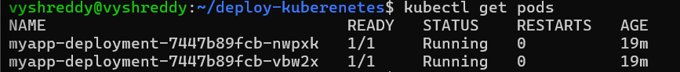
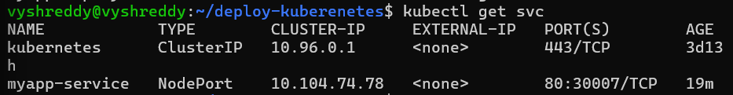
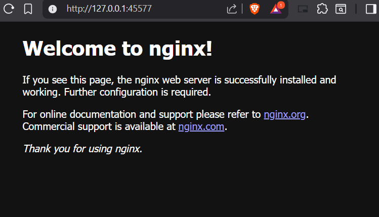

# Kubernetes Deployment with Minikube

## Objective
Deploy and manage applications on a local Kubernetes cluster using Minikube, kubectl, and Docker.

---

## Tools Used
- Minikube
- kubectl
- Docker

---

## Steps Performed

### 1. Start Minikube Cluster
```bash
minikube start
kubectl get nodes
### 2. Create Deployment
- Created `deployment.yaml` for Nginx app:

```yaml
apiVersion: apps/v1
kind: Deployment
metadata:
  name: myapp-deployment
spec:
  replicas: 2
  selector:
    matchLabels:
      app: myapp
  template:
    metadata:
      labels:
        app: myapp
    spec:
      containers:
      - name: myapp-container
        image: nginx:latest
        ports:
        - containerPort: 80
### Apply the deployment:
```bash
kubectl apply -f deployment.yaml
kubectl get pods

### 3. Expose Deployment with Service
- Created `service.yaml`:

```yaml
apiVersion: v1
kind: Service
metadata:
  name: myapp-service
spec:
  type: NodePort
  selector:
    app: myapp
  ports:
    - port: 80
      targetPort: 80
      nodePort: 30007

### Apply the service:
```bash
kubectl apply -f service.yaml
kubectl get svc


---

### 4. Access the Application
```markdown
### 4. Access the Application
- Open the app in browser:
```bash
minikube service myapp-service
## You should see the Nginx welcome page


---

### 5. Scale Deployment
```markdown
### 5. Scale Deployment
- Scale up:
```bash
kubectl scale deployment myapp-deployment --replicas=4
kubectl get pods
- Scale down:
```bash
kubectl scale deployment myapp-deployment --replicas=2
kubectl get pods

## Screenshots

1. **Pods Running**


2. **Services**


3. **Browser Output (Nginx)**


